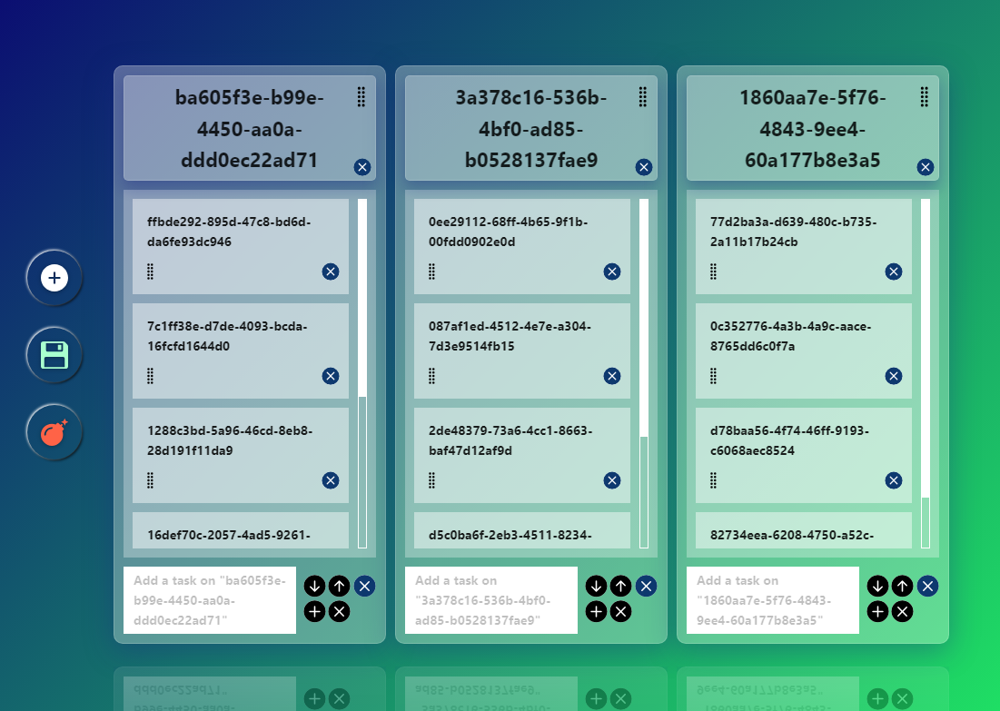

# React Practice Trello Clone Challenge

- **One of my personal digital nomad life projects (for practice).**
<!-- - **Project current status: [complete]**:ballot_box_with_check: -->
- **Project current status: [in progress]**
- **Tech**
<!-- 

  

    &emsp;
    
  

  

    &emsp;
    
    
  

  

    &emsp;
    
  

- **Features**
  - **Default 4 categories**
    - **"All" (Unremovable)**
    - **"To Do"**
    - **"Doing"**
    - **"Done"**
  - **Category CRUD**
    - **i.e. Also supports custom category**
    - **Supports multi-line category**
  - **Category search**
  - **To-do CRUD**
    - **Supports multi-line to-do text**
  - **Persistency (refresh, reopen)**
  - **Resizable multi-line to-do text input**
- **Demo: [React Practice To-do List App Challenge](https://hansf14.github.io/react-practice-to-do-list-app-challenge)**
- **Preview Screenshots**

  

    &emsp;
    
  

  &emsp;
  

    &emsp;
    
  

  &emsp;
  

    &emsp;
    
  

  

    &emsp;
    
  

  

    &emsp;
    
  

  

    &emsp;
    
  

  

    &emsp;
    
  

  

    &emsp;
    
  

  

    &emsp;
    
  

  

    &emsp;
    
  

  

    &emsp;
    
  

  

    &emsp;
    
  

  

    &emsp;
    
  

  -->
